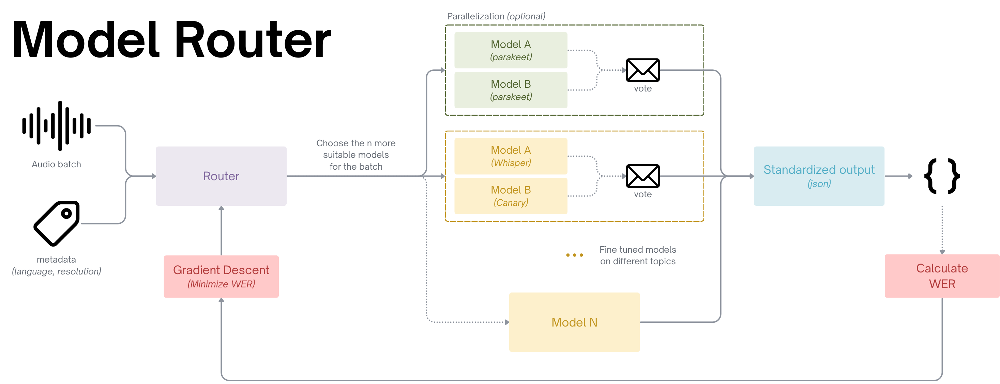

# MVP ASR Architecture
The goal is to find the best architecture for the best ASR!

We want to reach: **Efficiency**, **Quickness** and **Frugality**!

Here's are our architecture idea:

<p align="center">
  
</p>

## Standardisation for each model

For each model, there is a `model_type_name.py` in the folder "models" (either an API or a local processing) that creates the standardised JSON as output. 

For each model, make a function **"infer"** to compute the model and to create the output.

## Standardisation for the **JSON** output of an STT model

```bash
Batch :
- Batch ID (or the path + name)
- Info on the batch (language, total duration of the original audio, context, …)
- Text transcription of the batch
- Timestamp for the start and the end of the batch

Model :
- ASR Model Name
- Diarisation or not (bool) ==> Deleting or not "Speaker 0" for the WER test
- Compute duration
- Output: Text transcription of the model
```


<details>
<summary>See what it looks like</summary>

```bash
{
  "batch": {
    "batch_id": "batch_001",
    "info": {
      "language": "English",
      "total_duration_seconds": 360,
      "context": "Meeting recording with multiple speakers"
    },
    "true_transcription": "Hello everyone",
    "timestamps": {
      "start_sec": 0,
      "end_sec": 34
    }
  },
  "model": {
    "asr_model_name": "Whisper-XL",
    "diarisation": true,
    "compute_duration_seconds": 45,
    "output_transcription": "Hello everyone",
    "segments": [
          {
            "segment_id": 1,
            "speaker": "Speaker 1",
            "start_sec": 0.0,
            "end_sec": 12.4,
            "text": "Good morning everyone."
          },
          {
            "segment_id": 2,
            "speaker": "Speaker 2",
            "start_sec": 12.5,
            "end_sec": 28.9,
            "text": "Today we will review the quarterly financial results."
          }
        ]
  }
}
```

</details>

## Optimisation of the architecture (after)

- Word Boosting
- MoE
- FlashAttention
- vLLM
- Distillation
- Quantization
- Zipformer
- Pruning
- Merging
- Steering
- Parallelisation of the batch, frequency...
