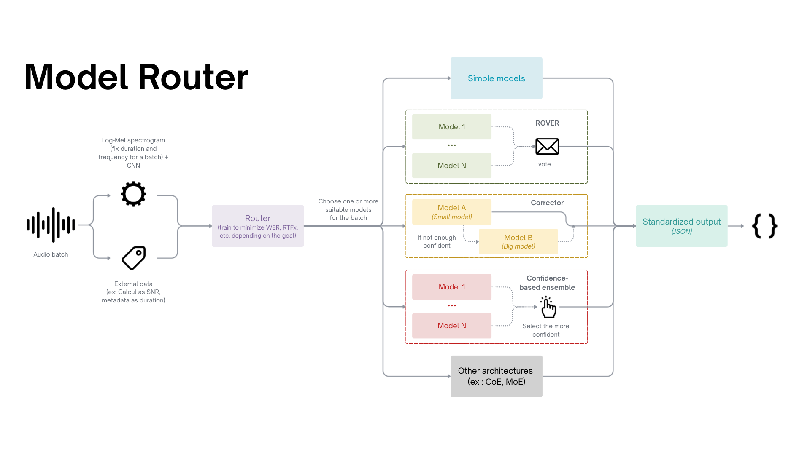
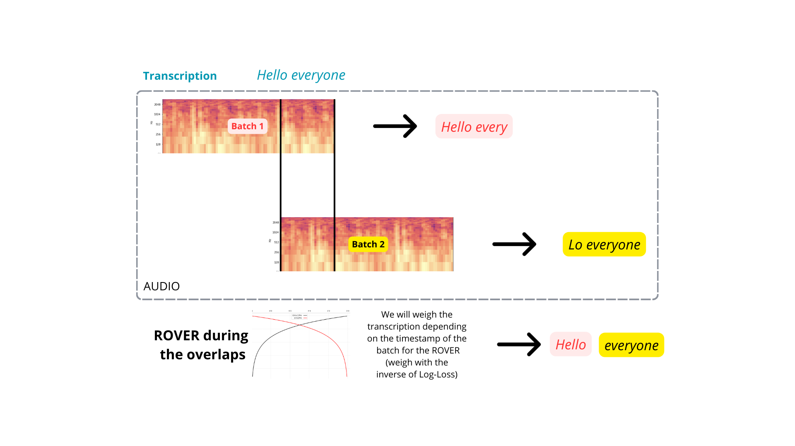

# MVP ASR Architecture

The goal is to find the best architecture for the best ASR!

We want to reach: **Efficiency**, **Quickness** and **Frugality**!

Here is the model router architecture idea :
<p align="center">
  
</p>


<details>
<summary>See the old architecture idea</summary>
<p align="center">
  
</p>

</details>

---

## Router
The goal is to create a Neural Network able to choose the n best models for a specific batch :

### Inputs :
#### The audio batch :
To link with the Neural Network, we can have some problemes : different resolutions and durations.

Different strategy is possible to solve it :
1. For the resolution :
- Choose a unique frequence (16 kHz) and resample all the audio to this value. But the router will learn some structural noize.

2. For the duration :
- Padding (shorter audio / add some 0 or noize) / Troncation (longer audio / cut) ==> simple but info lost / the duration are similar 
- Window cut (cut audio in fix frame with overlaps) ==> cut during a word ?
- Time/Frequency features (STFT, Log-Mel spectrogram, MFCC) to have a time * frequency image. ==> imposed a human vision + little info lost
- Global pooling (any cut) ==> crushed the temporal structure

My opinion : Log-Mel spectrogram + CNN + global or attention pulling and fixing the time of each batch with a big overlaps and make a ROVER during this timing  

#### Some metadata :
##### Needed :
- **SNR** (Signal-to-Noise Ratio)  
- **Duration** of the batch

##### Need to discuss with the group :
- **Languages** (if provided and see how to map)
- **Resolution** (8Hz (phones) to 44.1 kHz (studio)) ==> + or - robust models


##### Possible :
- **Bit Depth** : (ex: 16-bit, 24-bit) ==> sound dynamics
- **Field / theme** : (ex: medical, legal, conversation) ==> Simplify the process for the router
- **Duration** : be less energy-consumption (batch or total ?)


#### Idea for the overlaps
For the overlaps, I got an idea :

<p align="center">
  
</p>

### Outputs


---

## Standardisation for each model

For each model, there is a `model_type_name.py` in the folder "models" (either an API or a local processing) that creates the standardised JSON as output.

For each model, make a function **"infer"** to compute the model and to create the output.

---

## Standardisation for the **JSON** output of an STT model

```bash
Batch :
- Batch ID (or the path + name)
- Info on the batch (language, total duration of the original audio, context…)
- Text transcription of the batch
- Timestamp for the start and the end of the batch

Model :
- ASR Model Name
- Size Model / Category
- Diarisation or not (bool) ==> Deleting or not "Speaker 0" for the WER test
- Compute duration
- Output: Text transcription of the model
```

<details>
<summary>See what it looks like</summary>

```bash
{
  "batch": {
    "batch_id": "batch_001",
    "info": {
      "language": "English",
      "total_duration_seconds": 360,
      "context": "Meeting recording with multiple speakers"
    },
    "true_transcription": "Hello everyone",
    "timestamps": {
      "start_sec": 0,
      "end_sec": 34
    }
  },
  "model": {
    "asr_model_name": "Whisper-XL",
    "size_category": 0 or 1, "small/large"
    "diarisation": true,
    "compute_duration_seconds": 45,
    "output_transcription": "Hello everyone",
    "segments": [
          {
            "segment_id": 1,
            "speaker": "Speaker 1",
            "start_sec": 0.0,
            "end_sec": 12.4,
            "text": "Good morning everyone."
          },
          {
            "segment_id": 2,
            "speaker": "Speaker 2",
            "start_sec": 12.5,
            "end_sec": 28.9,
            "text": "Today we will review the quarterly financial results."
          }
        ]
  }
}
```

</details>


## WER test
Here is a link for the [WER test](https://huggingface.co/spaces/evaluate-metric/wer) !


## Optimisation of the architecture (after)

- Word Boosting
- MoE
- FlashAttention
- vLLM
- Distillation
- Quantization
- Zipformer
- Pruning
- Merging
- Steering
- Parallelization of the batch, frequency...
- Diarisation in parallel


---

## Installation

### Prerequisites

- Python 3.8 or higher

### Setup

1. **Clone the repository**

   ```bash
   git clone https://github.com/Thibault-GAREL/Rover_architecture.git
   cd Rover_architecture
   code .
   ```

2. **Install dependencies**

   ```bash
   pip install -r requirements.txt
   ```

3. **Configure environment variables**

   ```bash
   # Copy the example environment file
   cp .env.example .env

   # Edit .env with your own values
   # Update API keys, model paths, and other configuration as needed
   ```

4. **Run the application**
   ```bash
   python src/main.py
   ```
   
<!--
Add confiance in the Router

-->
